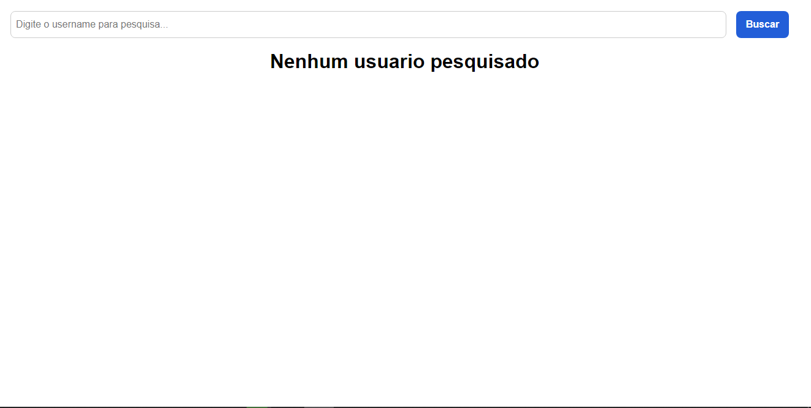
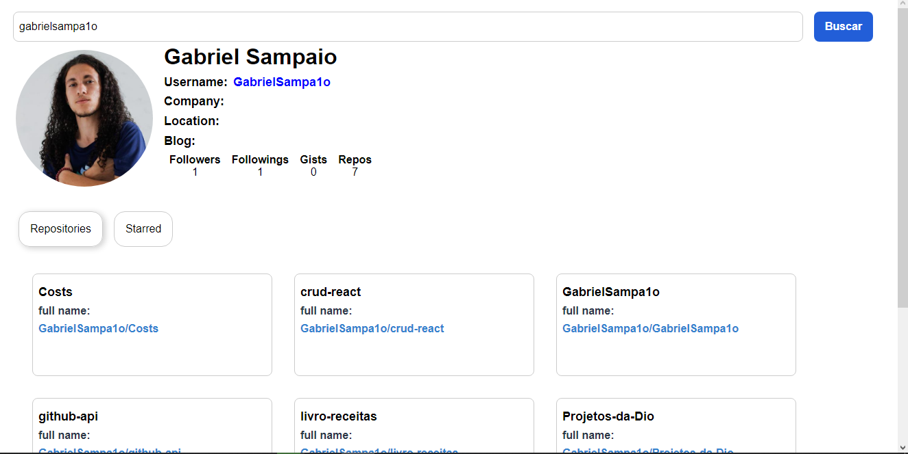

# GitHub API

Projeto que consome a API do github, e retorna o perfil, os repositórios do usuário que pesquisar.

Feito em ReactJS, utilizando o styled-components para estilizar 

[Visualizar a aplicação](https://gabrielsampa1o.github.io/github-api/)

